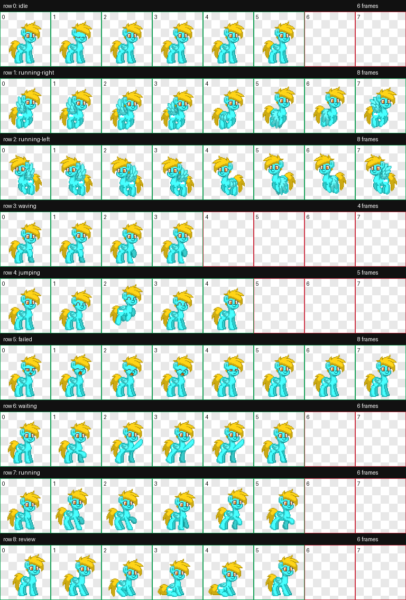

# 天蓝晨风 Skyblue · Codex Pet

由提供的 Pony Town 像素 GIF 转换而成的本机 Codex Pet 安装包，不是 pony.hachile.org 的网页版桌宠。

## Windows 安装

1. 下载此仓库（GitHub 的 Code → Download ZIP），解压。
2. 在文件资源管理器的地址栏输入 `%USERPROFILE%\.codex\pets`，新建 `skyblue-mornbreeze` 文件夹。
3. 将仓库根目录的 `pet.json` 和 `spritesheet.webp` 复制到该文件夹。安装不需要其他文件，也不需要 Python、Node.js 或构建步骤。
4. 打开应用的 Settings → Pets → Refresh，选择「天蓝晨风 Skyblue」。输入 `/pet` 显示或隐藏桌宠。[官方操作说明](https://learn.chatgpt.com/docs/pets)

安装后的目录：

```text
%USERPROFILE%\.codex\pets\skyblue-mornbreeze\
├── pet.json
└── spritesheet.webp
```

更新已有版本时，先备份旧的两个文件，再替换并刷新选择。请勿覆盖其他 Pet 的文件夹。

## 当前动作

- 空闲以站立为主，每约 6.6 秒眨眼一次，闭眼约 0.66 秒。
- 向左或向右拖拽会触发对应方向的飞行动作。
- 还包含打招呼、跳跃、打哈欠、抬蹄等待、跳舞及坐下起身，共九行标准状态。
- 图集为透明 WebP，1536 × 1872，192 × 208 单元格，`spriteVersionNumber` 为 1。

以上播放时序按本机验证过的应用版本制作；动作触发、循环次数、显示尺寸及缩放由应用控制。鼠标悬停后只跳一次再走动、所有动作记忆最后朝向等自定义交互，不属于本安装包已实现的功能。

## 预览与校验

用浏览器打开 `preview.html` 查看九种动作的循环预览，也可直接打开 `previews/` 中的 GIF。预览仅展示素材，不模拟 Codex 的完整交互。



`spritesheet.webp` 的 SHA-256：

```text
29ba73246e475ff60ba5a718b42565b7f5c75fe8372079414d6c3a9d2036a702
```

当前图集已通过尺寸、透明背景、57 个有效帧和 15 个空白单元格检查。
